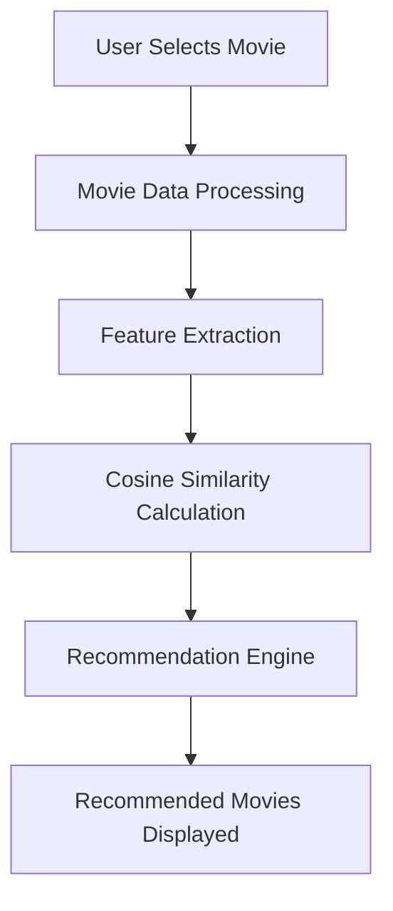

# 🎬✨ CineMatch AI — Movie Recommendation System

<div align="center">


### 🍿 Smart AI-Powered Movie Recommendation Engine

Discover movies you'll love using the power of **Machine Learning**,  
**Recommendation Systems**, and **Artificial Intelligence**.


</div>

---

# 🌟 Overview

CineMatch AI is an intelligent **Movie Recommendation System** built using **Machine Learning** techniques that recommends movies based on user interests and similarity analysis.

The system analyzes movie data such as:

🎭 Genres  
⭐ Ratings  
📝 Keywords  
🎬 Cast & Crew  
📖 Movie Overview  

and provides highly relevant movie suggestions instantly.

---

# 🚀 Key Features

✨ Personalized Movie Recommendations  
✨ AI-Powered Recommendation Engine  
✨ Content-Based Filtering  
✨ Collaborative Filtering  
✨ Cosine Similarity Algorithm  
✨ Fast & Responsive UI  
✨ Search Movies Instantly  
✨ Smart Similarity Analysis  
✨ Real-Time Recommendations  

---

# 🧠 Machine Learning Concepts Used

| Concept | Description |
|---|---|
| Recommendation Systems | Suggest movies intelligently |
| Cosine Similarity | Finds similar movies |
| NLP Techniques | Processes movie descriptions |
| Feature Engineering | Extracts useful movie features |
| Data Preprocessing | Cleans and prepares data |

---

# ⚡ Technologies Used

<div align="center">

| Technology | Purpose |
|---|---|
| 🐍 Python | Core Programming |
| 📊 Pandas | Data Analysis |
| 🔢 NumPy | Numerical Computing |
| 🤖 Scikit-learn | Machine Learning |
| 🌐 Streamlit / Flask | Web Application |
| 🎥 TMDB Dataset | Movie Dataset |

</div>

---

# 📂 Dataset Information

This project uses movie datasets containing:

✅ Movie Titles  
✅ Genres  
✅ Ratings  
✅ Cast Information  
✅ Keywords  
✅ Movie Overview  

### 📌 Datasets Used

- TMDB 5000 Movies Dataset
- MovieLens Dataset

---

# ⚙️ Working Process



---

# 🖥️ Project Preview

<div align="center">


</div>

---

# 🎯 Project Goals

🎬 Build a Smart Recommendation Engine  
🧠 Learn Real-World Machine Learning  
🚀 Improve User Experience with AI  
📊 Implement Recommendation Algorithms  
💡 Understand Similarity-Based Systems  

---

# 🔥 Algorithms Used

✅ Content-Based Recommendation  
✅ Collaborative Filtering  
✅ Cosine Similarity  

---

# 📁 Project Structure

```bash
Movie-Recommendation-System/
│
├── 📂 dataset
├── 📂 assets
├── 📂 models
├── 📄 app.py
├── 📄 recommendation.py
├── 📄 requirements.txt
├── 📄 README.md
└── 📄 model.pkl
```

---

# 💻 Installation & Setup

## 1️⃣ Clone Repository

```bash
git clone https://github.com/your-username/movie-recommendation-system.git
```

## 2️⃣ Navigate to Project

```bash
cd movie-recommendation-system
```

## 3️⃣ Install Dependencies

```bash
pip install -r requirements.txt
```

## 4️⃣ Run Application

```bash
streamlit run app.py
```

---

# 📈 Output

The system recommends movies similar to the selected movie with high relevance and accuracy using AI-based similarity analysis.

---

# 🚀 Future Enhancements

🔐 User Authentication System  
🤖 AI Chatbot Integration  
📱 Mobile App Version  
🌍 Multi-Language Support  
🧠 Deep Learning Recommendations  
🔥 Trending Movie Suggestions  
🎭 Personalized User Profiles  

---

# 🌟 Why This Project?

This project demonstrates the practical implementation of:

✔️ Machine Learning  
✔️ Recommendation Systems  
✔️ Artificial Intelligence  
✔️ Data Processing  
✔️ Real-World ML Applications  

It is an excellent portfolio project for:

🎓 Students  
💻 Developers  
🤖 AI Enthusiasts  
📊 Data Science Learners  

---

# 🤝 Contributing

Contributions are welcome!  
Feel free to fork this repository and improve the project 🚀

---

# 📜 License

This project is licensed under the MIT License.

---

# ⭐ Support

If you found this project useful, give it a ⭐ on GitHub and support the project!

---

<div align="center">

# 🎥 “Movies are better when AI helps you discover them.”

Made with ❤️ using Python & Machine Learning

</div>

---

# 📌 GitHub Topics

```bash
machine-learning
movie-recommendation-system
python
artificial-intelligence
recommendation-engine
streamlit
scikit-learn
data-science
ai-project
collaborative-filtering
```
